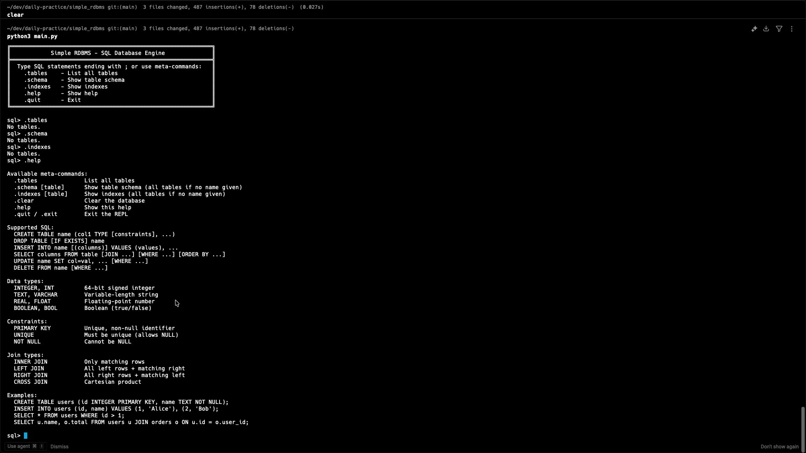
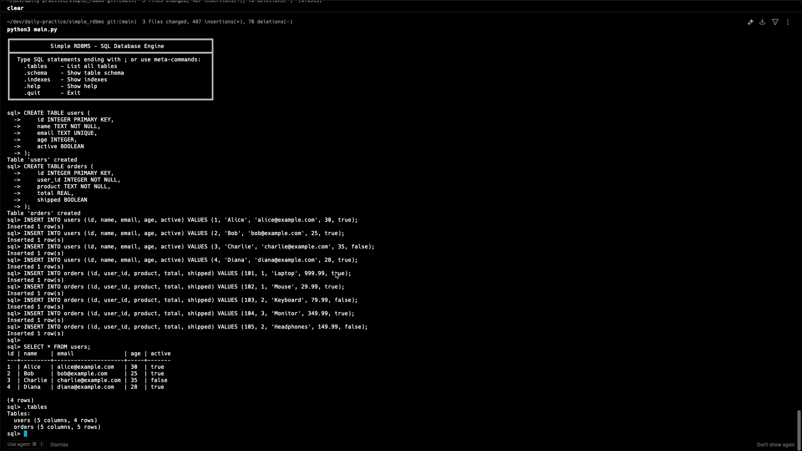
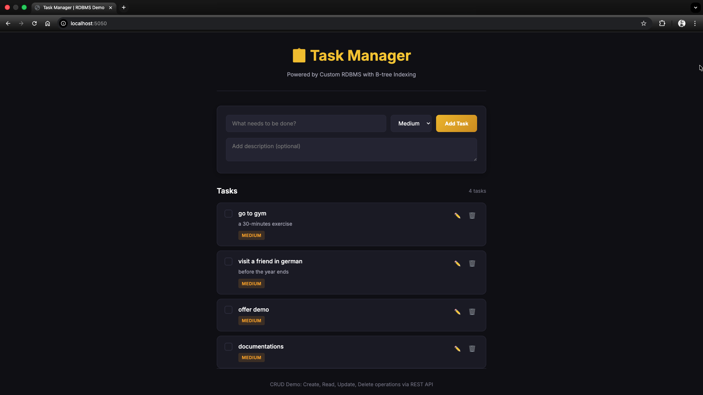

# Simple RDBMS

A lightweight relational database management system (RDBMS) built from scratch in Python, featuring a SQL parser, B-tree indexing, and an interactive REPL. Includes a demo Task Manager web application demonstrating CRUD operations.

> **Submission for**: Pesapal Junior Developer 2026 Challenge  
> **Author**: Pascal Twoli  
> **Date**: January 2026

---

## Table of Contents

- [Overview](#overview)
- [Features](#features)
- [Project Structure](#project-structure)
- [Getting Started](#getting-started)
- [SQL REPL Interface](#sql-repl-interface)
- [SQL Reference](#sql-reference)
- [Demo Web Application](#demo-web-application)
- [Architecture & Design](#architecture--design)
- [Testing](#testing)
- [Acknowledgments](#acknowledgments)
- [License](#license)

---

## Overview

This project implements a simple yet functional relational database management system from the ground up. The implementation includes:

1. **SQL Lexer & Parser** - Tokenizes and parses SQL statements into an Abstract Syntax Tree (AST)
2. **Query Executor** - Evaluates AST nodes and performs database operations
3. **Storage Engine** - In-memory table storage with row-based data management
4. **B-tree Indexing** - Efficient lookups on PRIMARY KEY and UNIQUE columns
5. **Interactive REPL** - Command-line interface with history and meta-commands
6. **Demo Web App** - Task Manager application showcasing all CRUD operations

### Why This Project?

This was built as a response to the Pesapal Junior Developer 2026 challenge, which asked candidates to:
- Design and implement a simple RDBMS
- Support table declarations with multiple data types
- Implement CRUD operations, basic indexing, primary/unique keys, and JOINs
- Provide a SQL-like interface with an interactive REPL
- Demonstrate usage with a trivial web app

---

## Features

### Core Database Features

| Feature | Description |
|---------|-------------|
| **Data Types** | `INTEGER`, `TEXT`, `REAL`, `BOOLEAN` (with aliases) |
| **Constraints** | `PRIMARY KEY`, `UNIQUE`, `NOT NULL` |
| **DDL** | `CREATE TABLE`, `DROP TABLE` (with `IF EXISTS`/`IF NOT EXISTS`) |
| **DML** | `INSERT`, `SELECT`, `UPDATE`, `DELETE` |
| **JOINs** | `INNER JOIN`, `LEFT JOIN`, `RIGHT JOIN`, `CROSS JOIN` |
| **Operators** | Arithmetic (`+`, `-`, `*`, `/`), Comparison (`=`, `<>`, `<`, `>`, `<=`, `>=`), Logical (`AND`, `OR`, `NOT`) |
| **Filtering** | `WHERE` clause with complex expressions |
| **Pattern Matching** | `LIKE` operator with `%` (any) and `_` (single char) wildcards |
| **NULL Handling** | `IS NULL`, `IS NOT NULL`, three-valued logic |
| **Sorting** | `ORDER BY` with `ASC`/`DESC` |
| **Pagination** | `LIMIT` and `OFFSET` |
| **Table Aliases** | `FROM users u`, `JOIN orders o` |

### Indexing

- **B-tree Implementation** - Custom B-tree data structure for efficient key lookups
- **Automatic Indexing** - Indexes auto-created on `PRIMARY KEY` and `UNIQUE` columns
- **Index Maintenance** - Indexes updated automatically on `INSERT`, `UPDATE`, `DELETE`
- **Range Queries** - B-tree supports range searches (internal capability)

### Interactive REPL

- **Multi-line Input** - SQL statements can span multiple lines (terminated by `;`)
- **Command History** - Persistent history saved to `~/.rdbms_history`
- **Meta-commands** - `.tables`, `.schema`, `.indexes`, `.help`, `.quit`
- **Pretty Printing** - Tabular output with proper alignment
- **Error Handling** - Clear error messages with line/column info

### Persistence

- **JSON Export/Import** - Database can be saved to and loaded from JSON files
- **Web App Persistence** - Task Manager data persists across server restarts

---

## Project Structure

```
simple_rdbms/
├── main.py           # Entry point: REPL and CLI interface
├── lexer.py          # SQL tokenizer (converts SQL to tokens)
├── parser.py         # SQL parser (converts tokens to AST)
├── ast_nodes.py      # AST node class definitions
├── executor.py       # Query execution engine
├── storage.py        # Table and Database storage classes
├── index.py          # B-tree index implementation
├── schema.py         # Table schema and catalog management
├── datatypes.py      # Data type definitions and validation
├── exceptions.py     # Custom exception classes
├── webapp.py         # Flask web server for demo app
├── database.json     # Persisted database file (auto-generated)
├── test_rdbms.sql    # SQL test script
├── README.md         # This documentation
└── static/           # Web app frontend
    ├── index.html    # Main HTML page
    ├── style.css     # Styling
    ├── app.js        # Frontend JavaScript
    └── README.md     # Web app documentation
```

---

## Getting Started

### Prerequisites

- **Python 3.8+** (uses dataclasses, type hints)
- **Flask** (for the web demo only)

### Installation

```bash
# Clone the repository
git clone https://github.com/PascalTwoli/simple_rdbms.git
cd simple_rdbms

# Install Flask for the web demo (optional)
pip install flask
```

### Running the REPL

```bash
# Start interactive SQL REPL
python3 main.py

# Execute a single SQL command
python3 main.py -c "SELECT 1 + 1;"

# Execute SQL from a file
python3 main.py -f test_rdbms.sql

# Show help
python3 main.py -h
```

### Running the Web Demo

```bash
# Start the Flask web server
python3 webapp.py

# Open in browser
# http://localhost:5050
```

---

## SQL REPL Interface

### Starting the REPL

```
$ python3 main.py
╔════════════════════════════════════════════════════════════╗
║            Simple RDBMS - SQL Database Engine              ║
╠════════════════════════════════════════════════════════════╣
║  Type SQL statements ending with ; or use meta-commands:   ║
║    .tables    - List all tables                            ║
║    .schema    - Show table schema                          ║
║    .indexes   - Show indexes                               ║
║    .help      - Show help                                  ║
║    .quit      - Exit                                       ║
╚════════════════════════════════════════════════════════════╝

sql>
```

### Meta-Commands

| Command | Description |
|---------|-------------|
| `.tables` | List all tables with column and row counts |
| `.schema [table]` | Show schema for one or all tables |
| `.indexes [table]` | Show B-tree indexes and entry counts |
| `.clear` | Clear all tables from the database |
| `.help` | Display help information |
| `.quit` / `.exit` / `.q` | Exit the REPL |

### Example Session

```sql
sql> CREATE TABLE users (
  ->     id INTEGER PRIMARY KEY,
  ->     name TEXT NOT NULL,
  ->     email TEXT UNIQUE
  -> );
Table 'users' created

sql> INSERT INTO users (id, name, email) VALUES 
  ->     (1, 'Alice', 'alice@example.com'),
  ->     (2, 'Bob', 'bob@example.com');
Inserted 2 row(s)

sql> SELECT * FROM users;
id | name  | email
---+-------+-----------------
1  | Alice | alice@example.com
2  | Bob   | bob@example.com

(2 rows)

sql> .indexes users

Indexes on users:
  id: B-tree (2 entries)
  email: B-tree (2 entries)

sql> .quit
Goodbye!
```

### Screenshots

**REPL Help & Meta-Commands**



*The REPL showing `.help` output with available meta-commands, supported SQL syntax, data types, constraints, and join types.*

**CRUD Operations Demo**



*Demonstration of CREATE TABLE, INSERT, SELECT operations with tabular output display.*

---

## SQL Reference

### Data Types

| Type | Aliases | Description | Example |
|------|---------|-------------|---------|
| `INTEGER` | `INT` | 64-bit signed integer | `42`, `-100` |
| `TEXT` | `VARCHAR`, `STRING` | Variable-length string | `'Hello'` |
| `REAL` | `FLOAT`, `DOUBLE` | 64-bit floating-point | `3.14`, `-0.5` |
| `BOOLEAN` | `BOOL` | Boolean value | `true`, `false` |

### Constraints

| Constraint | Description |
|------------|-------------|
| `PRIMARY KEY` | Unique, non-null identifier. Auto-creates B-tree index. |
| `UNIQUE` | Values must be unique (NULLs allowed). Auto-creates B-tree index. |
| `NOT NULL` | Column cannot contain NULL values. |

### Supported Statements

#### CREATE TABLE
```sql
CREATE TABLE [IF NOT EXISTS] table_name (
    column1 TYPE [constraints],
    column2 TYPE [constraints],
    ...
);
```

#### DROP TABLE
```sql
DROP TABLE [IF EXISTS] table_name;
```

#### INSERT
```sql
INSERT INTO table_name [(column1, column2, ...)]
VALUES (value1, value2, ...), (value1, value2, ...);
```

#### SELECT
```sql
SELECT columns | *
FROM table [alias]
[JOIN type] table [alias] ON condition
[WHERE condition]
[ORDER BY column [ASC|DESC], ...]
[LIMIT n]
[OFFSET n];
```

#### UPDATE
```sql
UPDATE table_name
SET column1 = value1, column2 = value2, ...
[WHERE condition];
```

#### DELETE
```sql
DELETE FROM table_name
[WHERE condition];
```

### Operators

| Category | Operators |
|----------|-----------|
| Comparison | `=`, `<>`, `!=`, `<`, `<=`, `>`, `>=` |
| Logical | `AND`, `OR`, `NOT` |
| NULL | `IS NULL`, `IS NOT NULL` |
| Pattern | `LIKE` (wildcards: `%` = any chars, `_` = single char) |
| Arithmetic | `+`, `-`, `*`, `/` |

### JOIN Types

| Type | Description |
|------|-------------|
| `INNER JOIN` | Only rows with matches in both tables |
| `LEFT JOIN` | All left rows + matching right rows (NULL for non-matches) |
| `RIGHT JOIN` | All right rows + matching left rows (NULL for non-matches) |
| `CROSS JOIN` | Cartesian product of both tables |

---

## Demo Web Application

A **Task Manager** web app demonstrates CRUD operations using the custom RDBMS as the backend.



*The Task Manager interface showing task list with priorities, add task form, and CRUD action buttons.*

### Features

- **Create** tasks with title, description, and priority
- **Read** all tasks in a responsive list view
- **Update** task details via modal dialog
- **Delete** tasks with confirmation
- **Toggle** task completion status
- **Persistent** storage via JSON file

### Running the Demo

```bash
python3 webapp.py
```

Then open [http://localhost:5050](http://localhost:5050) in your browser.

### Tech Stack

| Component | Technology |
|-----------|------------|
| Backend | Python + Flask |
| Database | Custom RDBMS (this project) |
| Frontend | Vanilla HTML/CSS/JavaScript |
| Styling | Custom CSS with modern design |
| Persistence | JSON file (`database.json`) |

### REST API Endpoints

| Method | Endpoint | Description |
|--------|----------|-------------|
| `GET` | `/api/tasks` | List all tasks |
| `POST` | `/api/tasks` | Create a new task |
| `GET` | `/api/tasks/:id` | Get a single task |
| `PUT` | `/api/tasks/:id` | Update a task |
| `DELETE` | `/api/tasks/:id` | Delete a task |

See [`static/README.md`](static/README.md) for detailed frontend documentation.

---

## Architecture & Design

### Component Overview

```
┌─────────────────────────────────────────────────────────────────┐
│                         User Input                              │
│                    (SQL string or API call)                     │
└─────────────────────────────────────────────────────────────────┘
                              │
                              ▼
┌─────────────────────────────────────────────────────────────────┐
│                          LEXER                                  │
│  Converts SQL text into a stream of tokens                      │
│  (keywords, identifiers, literals, operators)                   │
└─────────────────────────────────────────────────────────────────┘
                              │
                              ▼
┌─────────────────────────────────────────────────────────────────┐
│                          PARSER                                 │
│  Converts token stream into Abstract Syntax Tree (AST)          │
│  (CreateTableStmt, SelectStmt, InsertStmt, etc.)                │
└─────────────────────────────────────────────────────────────────┘
                              │
                              ▼
┌─────────────────────────────────────────────────────────────────┐
│                         EXECUTOR                                │
│  Traverses AST and performs operations on the database          │
│  (expression evaluation, JOIN logic, filtering)                 │
└─────────────────────────────────────────────────────────────────┘
                              │
                              ▼
┌─────────────────────────────────────────────────────────────────┐
│                         STORAGE                                 │
│  In-memory tables with row storage and index management         │
│  - Table: holds rows, manages constraints                       │
│  - Row: individual record with column values                    │
│  - IndexManager: manages B-tree indexes for fast lookups        │
└─────────────────────────────────────────────────────────────────┘
                              │
                              ▼
┌─────────────────────────────────────────────────────────────────┐
│                         B-TREE INDEX                            │
│  Self-balancing tree for O(log n) key lookups                   │
│  - Supports duplicate keys for non-unique indexes               │
│  - Auto-maintained on INSERT/UPDATE/DELETE                      │
└─────────────────────────────────────────────────────────────────┘
```

### Key Design Decisions

1. **In-Memory Storage**: All data is stored in Python dictionaries for simplicity. Persistence is achieved via JSON serialization.

2. **B-tree Order**: Default order of 32 provides good balance between tree height and node size for typical workloads.

3. **Three-Valued Logic**: NULL handling follows SQL standard with proper `AND`/`OR` semantics.

4. **Case Insensitivity**: Table/column names are case-insensitive (stored lowercase internally).

5. **No Query Optimizer**: Queries execute via straightforward iteration. Index usage is automatic for equality lookups on indexed columns.

### B-tree Implementation Details

The B-tree (`index.py`) is a self-balancing tree with:

- **Configurable order** (default: 32, minimum: 3)
- **Duplicate key support** via value lists
- **Operations**: insert, delete, search, range_search
- **Node structure**: keys[], values[] (lists of row IDs), children[]

```
         [50]
        /    \
    [20,30]  [70,80]
    /  |  \   /  |  \
  [...][...][...][...][...]
```

---

## Testing

### Running the Test Script

The `test_rdbms.sql` file contains comprehensive tests:

```bash
python3 main.py -f test_rdbms.sql
```

### Test Coverage

| Test | Description |
|------|-------------|
| Test 1-2 | CREATE TABLE and INSERT |
| Test 3 | Basic SELECT with WHERE and ORDER BY |
| Test 4-5 | INNER JOIN and LEFT JOIN |
| Test 6-7 | UPDATE and DELETE |
| Test 8-9 | Complex WHERE conditions and LIKE |
| Test 10 | NULL handling |
| Test 11-16 | Index operations and maintenance |

### Manual Testing Examples

```sql
-- Test constraint violations
INSERT INTO users (id, name) VALUES (1, 'Duplicate');  -- PRIMARY KEY violation
INSERT INTO users (id, name, email) VALUES (10, NULL, 'test@test.com');  -- NOT NULL violation

-- Test JOIN correctness
SELECT u.name, o.product 
FROM users u 
LEFT JOIN orders o ON u.id = o.user_id;

-- Test pattern matching
SELECT * FROM users WHERE name LIKE '%ob';  -- Matches 'Bob', 'Rob'
SELECT * FROM users WHERE email LIKE '%@%.com';
```

---

## Acknowledgments

- **AI Assistance**: GitHub Copilot and Claude were used for code generation, debugging, and documentation. All code was reviewed, understood, and adapted by the author.
- **References**: 
  - SQLite documentation for SQL syntax reference
  - "Introduction to Algorithms" (CLRS) for B-tree implementation concepts
  - Flask documentation for web server implementation

---

## License

MIT License - See [LICENSE](LICENSE) file for details.

---

## Contact

For questions or feedback regarding this submission:
- **GitHub**: [github.com/PascalTwoli](https://github.com/PascalTwoli)
- **Email**: pascaltwoli@gmail.com

---

*Built with ❤️ for the Pesapal Junior Developer 2026 Challenge*
